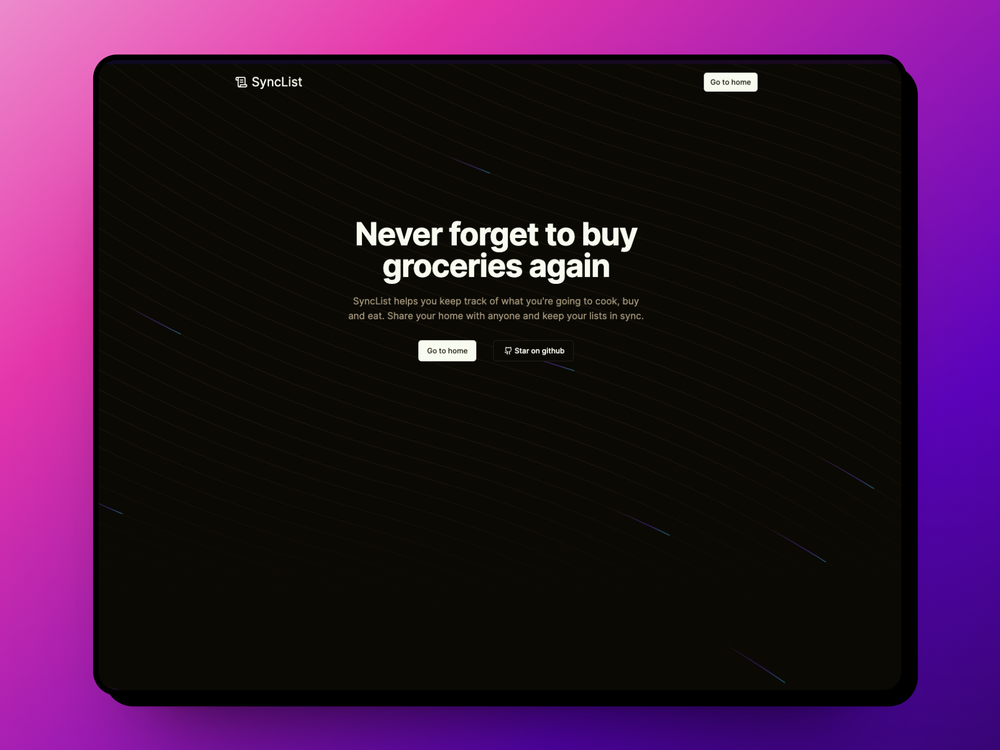

<picture>
 <source media="(prefers-color-scheme: dark)" srcset="images/logo.png">
 
</picture>

---

⚠️ This project is still a very early work in progress and was made for [Supabase's OSS Hackaton](https://supabase.com/blog/supabase-oss-hackathon) ⚠️

SyncList is a meal prep / grocery manager app for households. It helps you keep track of what you can cook for a given period and automatically assembles a grocery list for you.

You can also add any custom item to your list, which syncs in real time with everyone on that same home, making quick runs to the grocery store much more efficient.

Feel free to make contributions,



## Development

This project uses the following stack:

- [Remix](https://remix.run/) to run the fullstack app.
- [Supabase](https://supabase.com/) for authentication, database and realtime functionality.
- [Bun](https://bun.sh/) as a package manager.
- [Cloudflare](https://pages.cloudflare.com/) pages for deployment.
- [BiomeJS](https://biomejs.dev/) for linting and formatting files.
- [ShadcnUI](https://ui.shadcn.com/) for ui components.

To run locally, clone the project and install dependencies:

```sh
bun install
```

Then, run supabase locally:

```sh
bunx supabase start
```

Replace `.dev.vars.example` with `.dev.vars` and fill it with Supabase's variables.
Finally, start the project:

```sh
bun dev
```
